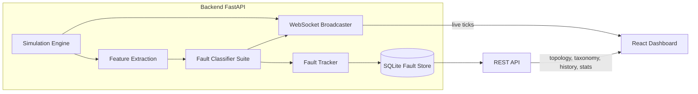

# GPU Fault Classifier

A hands-on platform for learning and demonstrating **GPU interconnect bottleneck detection**
and **fault classification** on an *emulated* multi-node GPU cluster — no real GPUs required.

It combines:

1. **Simulator** — a synthetic 4-node × 4-GPU cluster (NVLink/NVSwitch within a node,
   RoCE/InfiniBand fabric between nodes) that streams realistic telemetry and injects
   randomized, gradually-onsetting faults.
2. **ML Fault Classifier** — a suite of per-component RandomForest models trained on
   simulator-generated labeled data, classifying both **broad GPU health faults**
   (ECC errors, thermal/power throttling, Xid/driver errors, compute hangs) and
   **deep interconnect faults** (NVLink degradation/flapping, PCIe bottlenecks,
   fabric congestion/link-down, NCCL stragglers/timeouts).
3. **Monitoring Dashboard** — a real-time React UI visualizing cluster topology and
   health, live metrics, a live fault feed, and historical fault tracking/trends.

## Architecture



## Fault Taxonomy

Distributed GPU training is a synchronous-barrier problem: one degraded link or
straggler rank stalls the entire cluster. Knowing **which layer** a fault originates
at — physical signal integrity, data-link CRC, fabric congestion, host transport,
NCCL collectives, or GPU health — is what turns a raw alert into an actionable
diagnosis instead of a generic "something is slow" ticket.

| Family | Fault | Layer | Component | Severity |
|---|---|---|---|---|
| GPU health | Uncorrectable ECC Error | GPU Health | GPU | critical |
| GPU health | Thermal Throttling | GPU Health | GPU | warning |
| GPU health | Power Throttling | GPU Health | GPU | warning |
| GPU health | Xid / Driver Error | GPU Health | GPU | critical |
| GPU health | GPU Compute Hang | GPU Health | GPU | critical |
| Interconnect | NVLink Degradation | Data Link | NVLink | warning |
| Interconnect | NVLink Link Flap | Data Link | NVLink | critical |
| Interconnect | PCIe Link Bottleneck | Transport | PCIe | warning |
| Interconnect | Fabric Congestion | Network | Network | warning |
| Interconnect | Fabric Link Down | Network | Network | critical |
| Interconnect | NCCL Straggler Rank | NCCL | NCCL | warning |
| Interconnect | NCCL Collective Timeout | NCCL | NCCL | critical |

See [backend/app/classifier/labels.py](backend/app/classifier/labels.py) for full definitions.

## Key Metrics

Temperature, SM utilization, and power draw catch the obvious failure modes, but real
GPU clusters go quietly wrong in ways those three metrics never show. The simulator
also generates the diagnostic counters below — every one of them is a genuine,
stateful signal (not a cosmetic display value): they accumulate over the run like
real hardware counters, move only when their corresponding fault is injected, and are
fed into the classifier's feature set alongside the baseline metrics.

| Metric | Component | What it catches that temp/util/power alone would miss |
|---|---|---|
| `eccSbeCount` | GPU Health | Rising single-bit ECC corrections are an early-warning sign of failing memory cells, long before anything is uncorrectable. |
| `eccDbeCount` | GPU Health | Uncorrectable (double-bit) ECC errors — the direct precursor to Xid 48/63/64 and job crashes. |
| `retiredPagesCount` | GPU Health | Cumulative memory pages retired due to repeated ECC errors; a climbing count means available HBM capacity is shrinking under the job's feet. |
| `throttleReason` | GPU Health | Distinguishes *why* clocks dropped (`thermal` vs `power_cap` vs others) — the same clock/power dip looks identical without this, but the fix (cooling vs. power budget) is completely different. |
| `crcErrorCount` | NVLink | Cumulative CRC errors on a link — physical-layer signal integrity degrading before it fully fails. |
| `replayCount` | NVLink | Retransmitted packets; rising replays quietly eat bandwidth and add latency without ever making the link go "down". |
| `activeLaneCount` vs `expectedLaneCount` | NVLink | **Catches silent link down-training**: a link can keep running, report `linkUp = 1`, and throw zero errors while operating on half its negotiated lanes — invisible to every other signal, but it halves available bandwidth. |
| `recoveryCount` | NVLink | Counts link down→up transitions; a link that keeps "recovering" is flapping even if it happens to be up at any given sampling instant. |

`training_report.json` (regenerated by `python -m app.classifier.train`) confirms
these aren't cosmetic: `throttleReason` is the single highest-importance feature for
GPU fault classification, and `activeLaneCount` is the #2 feature for NVLink fault
classification, right behind the CRC error rate.

## Project layout

```
gpu-fault-classifier/
├── backend/
│   ├── app/
│   │   ├── simulator/     # topology, telemetry generation, fault injection, live engine
│   │   ├── classifier/    # fault taxonomy, feature extraction, model, training script
│   │   ├── store/         # SQLite fault episode store
│   │   └── api/           # FastAPI app, REST routes, WebSocket, fault tracker
│   ├── data/               # SQLite DB (gitignored)
│   └── requirements.txt
└── frontend/
    ├── src/
    │   ├── components/     # NodeCard, NetworkFabric, DetailPanel, FaultFeed, HistoryView...
    │   ├── hooks/          # useTelemetryStream (WebSocket), useFetch
    │   └── lib/            # API client, formatting, health helpers
    └── package.json
```

## Getting started

### One-time setup

```bash
# Backend
cd backend
python3 -m venv .venv
source .venv/bin/activate
pip install -r requirements.txt

# Train the fault classifier on simulator-generated synthetic data
# (this also happens automatically on first server start if no model is found)
PYTHONPATH=. python -m app.classifier.train
cd ..

# Frontend + root dev runner
cd frontend && npm install && cd ..
npm install
```

### Run both (backend + frontend)

From the repo root:

```bash
npm run dev
```

Or without the root `npm install`, use the shell script:

```bash
chmod +x scripts/dev.sh   # first time only
./scripts/dev.sh
```

This starts:
- **Backend** — `http://localhost:8000` (REST + WebSocket at `/ws/telemetry`)
- **Frontend** — Vite dev server (default `http://localhost:5173`)

Open the frontend URL in your browser. It connects to `http://localhost:8000` by default;
override with a `.env` file in `frontend/` setting `VITE_API_BASE`.

The backend will:
- Advance the simulated cluster one tick per second, injecting randomized faults on GPUs, NVLinks, PCIe links, the inter-node fabric, and NCCL collectives.
- Run every component's rolling telemetry window through the trained classifier.
- Persist detected fault "episodes" (open → active → resolved) to `backend/data/faults.db`.
- Broadcast live ticks over `ws://localhost:8000/ws/telemetry`.

### Run separately (optional)

**Backend only:**

```bash
cd backend && source .venv/bin/activate
PYTHONPATH=. uvicorn app.api.main:app --reload --port 8000
```

**Frontend only:**

```bash
cd frontend && npm run dev
```

## Retraining the classifier

The classifier is trained purely from the simulator, so you can freely tune fault
signatures, thresholds, or the sample count and retrain:

```bash
cd backend && source .venv/bin/activate
PYTHONPATH=. python -m app.classifier.train
```

This regenerates `backend/app/models/fault_classifier.joblib` plus a
`training_report.json` with per-component accuracy, classification reports, and
confusion matrices.

## Extending toward real hardware

The simulator and classifier are decoupled through a single interface: a rolling
window of per-component metric dictionaries (`app/classifier/features.py`). Anything
that produces dicts shaped like `app/simulator/telemetry.py`'s `TICK_FUNCS` output,
keyed by the same component-key scheme, runs through the existing feature extraction,
classifier, fault tracker, WebSocket broadcast, and dashboard completely unmodified.

`app/collectors/` implements the first slice of this for real GPUs:

- **`nvml_gpu.py`** — `NvmlGpuCollector` polls every GPU visible to the host via
  NVIDIA's NVML bindings (`pynvml`) and returns metric dicts matching the `gpu`
  component schema exactly (utilization, temperature, power, clocks, ECC SBE/DBE
  counts, retired pages, Xid events, throttle reason).
- **`real_engine.py`** — `RealTelemetryEngine` mirrors `SimulationEngine`'s interface
  (`tick`/`window_for`/`is_window_ready`/`component_type_of`) but sources the `gpu`
  layer from `NvmlGpuCollector` instead of the synthetic generator. NVLink, PCIe, and
  NCCL have no real source wired up yet, so they always report a healthy synthetic
  baseline — never a fabricated fault — and the topology is sized to whatever GPU
  count NVML reports on the host (single node, no synthetic inter-node fabric).

Run it with:

```bash
pip install nvidia-ml-py   # optional dep, not in requirements.txt by default
cd backend && source .venv/bin/activate
PYTHONPATH=. TELEMETRY_MODE=nvml uvicorn app.api.main:app --reload --port 8000
```

**What's still missing for a full real-cluster deployment:**

- **NVLink / PCIe** — NVML exposes most of the same counters used here for GPUs
  (`nvmlDeviceGetPcieThroughput`, `nvmlDeviceGetNvLinkUtilizationCounter`,
  `nvmlDeviceGetNvLinkErrorCounter`, ...); wiring them up is the natural next
  collector to add.
- **Inter-node fabric** — InfiniBand/RoCE counters (`ibstat`/`perfquery`, or
  switch-vendor tooling) aren't NVML's domain and need a separate collector.
- **NCCL** — has no passive polling API; collective timing/straggler signals need
  instrumentation inside the training job itself (hooked into the training loop or
  parsed from `NCCL_DEBUG` logs).
- **Retraining** — the shipped classifier is trained purely on the simulator's
  synthetic fault distributions (see `app/classifier/train.py`). Its predictions on
  real telemetry are a starting point, not a calibrated result — treat real incidents
  as labeled examples to retrain against before trusting the output.
